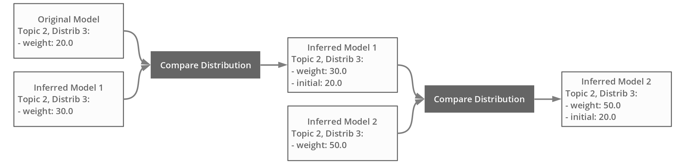

# Topic Mapping Pipeline [![CC BY-NC 4.0][cc-by-nc-shield]][cc-by-nc]

[< Previous](TopicDistributionModule.md) | [Index](index.md) | [Next >](TopicClusteringModule.md)

---

# Compare Distribution Module

The Compare Distribution module reads two sets of topics (same topics, one set old and one set with new inferred 
documents) and produces a comparison of their distributions. Each comparison is saved with the new topics, in their 
***Topic JSON files*** , and optionally on separate ***Comparison CSV file(s)*** for summary.

The use of this module is optional, and only fits with the use of the [Document Inference module](InferenceModule.md):
with new documents having their topic distribution inferred, topics have new weights.

The Compare Distribution module is contained in the `P4_Analysis.TopicDistribution` package, in the
`CompareDistributions.java` class.

## Specifications

The Compare Distribution module entry in the project file should have the following structure:
```json5
{...
  "compareDistributions": {
    "topics" | "mainTopics": "path",
    "previousTopics" | "previousMainTopics": "path",
    "subTopics": "path",
    "previousSubTopics": "path",
    "distributions": ["name", ...],
    "numWordId": 3,
    "mainOutput": "path",
    "subOutput": "path",
    "output": "path"
  },
...}
```

| Name | Description | Optional | Default |
| --- | --- | --- | --- |
| `topics` or `mainTopics` (if the model is hierarchical) | Path to the new (main) topics JSON file, with distribution(s) including inferred documents * | No | |
| `previousTopics` or `previousMainTopics` (if the model is hierarchical) | Path to the old (main) topics JSON, with distribution(s) ** | No | |
| `subTopics` | Path to the new sub topics JSON file, with distribution(s) including inferred documents * | Required if the model is hierarchical | `""` *** |
| `previousSubTopics` | Path to the old sub topics JSON, with distribution(s) ** | Required if the model is hierarchical | |
| `distributions` | List of distributions' names (`[fieldName]-[valueName]`) to compare | No, must have at least one value | |
| `numWordid` | Number of labels used to identify topics in the comparison CSV file(s) | Yes | `3` |
| `mainOutput` | Path to the CSV file comparing the distributions over main topics * | Yes | `""` (no export) |
| `subOutput` | Path to the CSV file comparing the distributions over sub topics * | Yes | `""` (no export) |
| `output` | Path to the CSV file comparing the distributions over both main and sub topics, note that if the model is non-hierarchical, this is equivalent to `mainOutput` * | Yes | `""` (no export) |
- \* These paths are relative to the [data directory](MetaParameters.md);
- \** These paths are relative to the [source directory](MetaParameters.md);
- \*** This default value implies a non-hierarchical model, if the [model type meta-parameter](MetaParameters.md) is set to `hierarchical`, a path must be provided.

## Output

The distribution comparisons are automatically saved within the *new* topics JSON file(s) (`topics`/`mainTopics` and `subTopics`).

Each entry in the topics' `totals` lists gets a new attribute: 
 ```json5
{...
"topics": [
    {
      "topicId": "0",
      "topicIndex": 0,
      "subTopicIds": [ ... ],
      "topDocs": [ ... ],
      "topWords": [ ... ],
      "totals": [
        {
          "weight": 295.0,
          "initial": 247.0,
          "id": "fieldName-valueName"
        }, ...
      ],
      "distributions": [ ... ]
    }, ...
  ]
...}
```
`initial` corresponds to the *original* total weight of this distribution, as calculated from the original model, i.e., 
without inferred documents. It is inherited from the previous topics JSON file, either from their total distributions' 
weights (if this file corresponds to the original model), or from their total distributions' initial value, that was 
itself inherited:



Additionally, distribution comparisons can be exported on dedicated CSV file(s) (`mainOutput`, `subOutput` or `output`):
```csv
"topic",                "distrib1_initial", "distrib1_previous", "distrib1_current", "distrib1_diffInitial", "distrib1_diffPrevious", "distrib2_initial", ...
"label1-label2-label3", "25.0",             "35.0",              "40.0",             "15.0",                 "5.0",                   "0.984",            ...
...
```
The `topic` column identifies topics using their top labels. Then, for each distribution compared:
- the `initial` column indicates the *original* topic weight (without inferred documents);
- the `previous` column indicates the topic weight in the previous topic JSON file (whether it is different from the original or not);
- the `current` column indicates the topic weight in the new topic JSON file;
- the `diffInitial` column indicates the difference between the `current` column and the `initial` column;
- the `diffPrevious` column indicates the difference between the `current` column and the `previous` column.

---

[< Previous](TopicDistributionModule.md) | [Index](index.md) | [Next >](TopicClusteringModule.md)

This work is licensed under a [Creative Commons Attribution 4.0 International
License][cc-by-nc].

[![CC BY-NC 4.0][cc-by-nc-image]][cc-by-nc]

[cc-by-nc]: http://creativecommons.org/licenses/by-nc/4.0/
[cc-by-nc-image]: https://i.creativecommons.org/l/by-nc/4.0/88x31.png
[cc-by-nc-shield]: https://img.shields.io/badge/License-CC%20BY--NC%204.0-lightgrey.svg