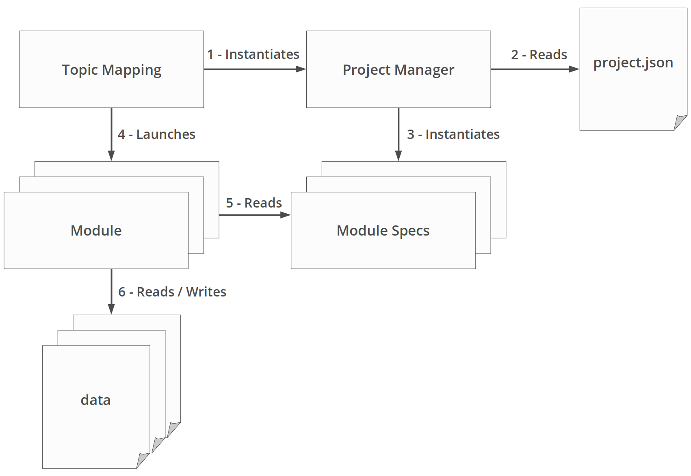

# Topic Mapping Pipeline - 2020 [![CC BY-NC 4.0][cc-by-nc-shield]][cc-by-nc]
# System Overview

## General Pipeline Flow



The main class of the pipeline is `TopicMapping.java`. It is called with one argument: the path to a ***project file*** 
where all the specifications (or modules' parameters) are written. Upon being called it will instantiate a ***Project 
Manager*** (package `P0_Project`, class `ProjectManager.java`).

The Project Manager will then read the project file, and instantiate the appropriate ***Module Specs*** (package
`P0_Project`, `...ModuleSpecs.java` classes), which will each interpret the specifications for their respective modules.

`TopicMapping.java` will then call the appropriate modules (only those to be executed, in a specific order) which will
execute according to the specifications set in their respective Module Spec class. These modules are the ones reading
and writing data files.

## Modules Order

There are 6 modules developed at the moment, running in the following order:
1) ***Input*** (`P1_Input` package) reading text data and formatting it in a corpus JSON file;
2) ***Lemmatise*** (`P2_Lemmatise` package) reading the corpus, lemmatising it, and generating a lemma JSON file;
3) ***Model*** (`P3_TopicModelling` package) reading the lemmas, generating topic models (including hierarchical ones)
and saving the topic and document data in JSON files;
4) ***Label Index*** (`P4_Analysis.LabelIndex` package) reading the topic data and generating an index of their labels;
5) ***Topic Distribution*** (`P4_Analysis.TopicDistribution` package) reading the topic and document data to calculate
the distribtution of topics over specific the documents (including per field and/or using specific values);
6) ***Topic Clustering*** (`P4_Analysis.TopicClustering` package) reading the topic data and generating groups of
sub topics and hierarchical clusters of topics.

## Project File

The ***project file*** is a JSON data file containing the specifications for the pipeline. It is organised as follow:
```json5
{
  "run": {                      // detail of modules to run
    "input": true,
    "lemmatise": true,
    "model": true,
    "indexLabels": true,
    "distributeTopics": true,
    "clusterTopics": true
  },
  "input": { ... },             // specs for input module
  "lemmatise": { ... },         // specs for lemmatise module
  "model": { ... },             // specs for model module
  "indexLabels": { ... },       // specs for label index module
  "distributeTopics": { ... },  // specs for topic distribution module
  "clusterTopics": { ... }      // spces for topic cluster module
}
```

---

[< Previous](GettingStarted.md) | [Index](index.md) | [Next >](InputModule.md)

---
This work is licensed under a [Creative Commons Attribution 4.0 International
License][cc-by-nc].

[![CC BY-NC 4.0][cc-by-nc-image]][cc-by-nc]

[cc-by-nc]: http://creativecommons.org/licenses/by-nc/4.0/
[cc-by-nc-image]: https://i.creativecommons.org/l/by-nc/4.0/88x31.png
[cc-by-nc-shield]: https://img.shields.io/badge/License-CC%20BY--NC%204.0-lightgrey.svg
