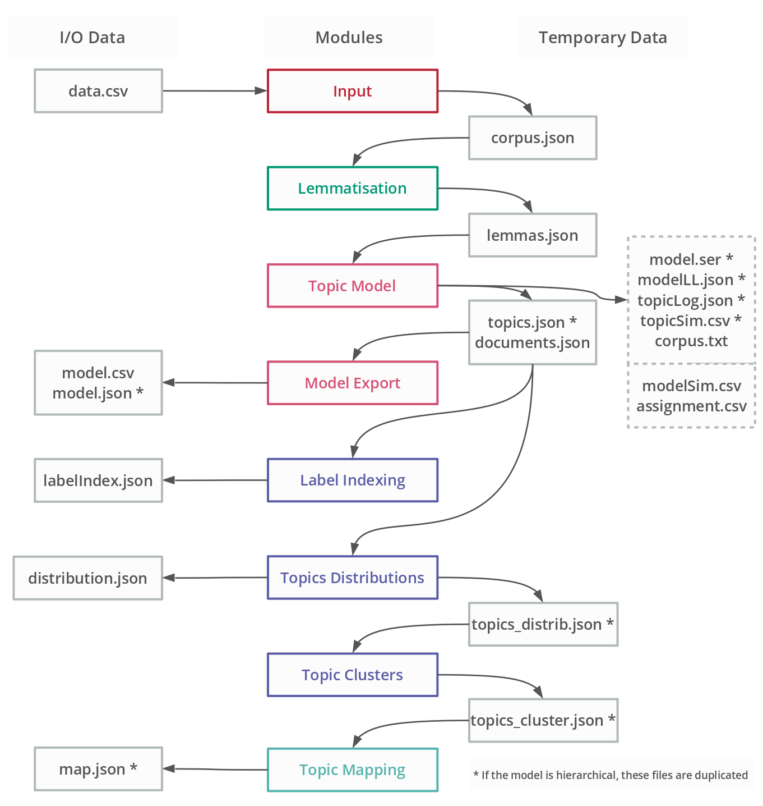
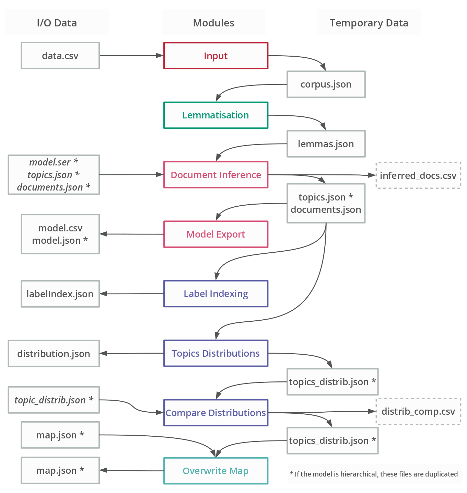

# Topic Mapping Pipeline - 2020 [![CC BY-NC 4.0][cc-by-nc-shield]][cc-by-nc]
# System Overview

## General Pipeline Flow


The main class of the pipeline is `TopicMapping.java`. It is called with one argument: the path to a ***project file*** 
where all the specifications (or modules' parameters) are written. Upon being called it will instantiate a ***Project 
Manager*** (package `P0_Project`, class `ProjectManager.java`).

The Project Manager will then read the project file, and instantiate the appropriate ***Module Specs*** (package
`P0_Project`, `...ModuleSpecs.java` classes), which will each interpret the specifications for their respective modules.

`TopicMapping.java` will then call the appropriate modules (only those to be executed, in order) which will execute
according to the specifications set in their respective Module Spec class. These modules are the ones reading
and writing data files.

## Modules

There are 11 modules developed at the moment:
- ***Input*** (`P1_Input` package) reading text data and formatting it in a corpus JSON file;
- ***Lemmatise*** (`P2_Lemmatise` package) reading the corpus, lemmatising it, and generating a lemma JSON file;
- ***Model*** (`P3_TopicModelling` package) reading the lemmas, generating topic models (including hierarchical ones)
and saving the topic and document data in JSON files;
- ***Infer Documents*** (`P3_TopicModelling` package) reading a topic model and lemmatised documents (not from the 
model), to infer the topic distributions of those documents;
- ***Export Model*** (`P3_TopicModelling` package) reading the model data outputs and generating concise model JSON 
files, as well as complete CSV files;
- ***Label Index*** (`P4_Analysis.LabelIndex` package) reading the topic data and generating an index of their labels;
- ***Topic Distribution*** (`P4_Analysis.TopicDistribution` package) reading the topic and document data to calculate
the distribtution of topics over specific the documents (including per field and/or using specific values);
- ***Compare Distributions*** (`P4_Analysis.TopicDistribution` package) reading two sets of topic distribution data
to calculate the evolution of distributions across identical topics;
- ***Topic Clustering*** (`P4_Analysis.TopicClustering` package) reading the topic data and generating groups of
sub topics and hierarchical clusters of topics;
- ***Topic Mapping*** (`P5_TopicMapping` package) reading the clustered topic data and generating the map data;
- ***Overwrite Map*** (`P5_TopicMapping` package) reading the map data and new distributed topics to create an updated
version of the map data (topic size or labels);

The pipeline can be used to run two different processes. First, the topic modelling and mapping process, reading
documents and generating topic model and topic map data from it:



Second, the document inference process, reading both documents and updating existing topic model and topic map data:
 


## Project File

The ***project file*** is a JSON data file containing the specifications for the pipeline. It is organised as follow:
```json5
{
  "run": {                      // modules to run
    "input": true,
    "lemmatise": true,
    "model": true,
    "inferDocuments": false,
    "exportTopicModel": true,
    "indexLabels": true,
    "distributeTopics": true,
    "compareDistributions": false,
    "clusterTopics": true,
    "mapTopics": true,
    "overwriteMap": false
  },
  "metaParameters": { ... },       // Parameters completing / overwriting module-level specs
  "input": { ... },                // specs for input module
  "lemmatise": { ... },            // specs for lemmatise module
  "model": { ... },                // specs for model module
  "inferDocuments": { ... },       // specs for the document inference module
  "exportTopicModel": { ... },     // specs for the topic model export module
  "indexLabels": { ... },          // specs for label index module
  "distributeTopics": { ... },     // specs for topic distribution module
  "compareDistributions": { ... }, //specs fof the distribution comaprison module
  "clusterTopics": { ... },        // specs for topic cluster module
  "mapTopics": { ... },            // specs for the topic mapping module
  "overwriteMap": { ... }          // specs for the map overwrite module
}
```

The `run` object is mandatory. It allows you to specify the modules to run (`true`) or not run (`false`).
By default, each module run will be set to `false` (don't run).

The `metaParameter` object contains project-wide specification (as opposed to module-level ones) that will complete or 
sometimes overwrite the module-level specifications.

The other objects are only necessary if the respective module should be run (the project manager won't read them if not
necessary). 

---

[< Previous](GettingStarted.md) | [Index](index.md) | [Next >](MetaParameters.md)

---
This work is licensed under a [Creative Commons Attribution 4.0 International
License][cc-by-nc].

[![CC BY-NC 4.0][cc-by-nc-image]][cc-by-nc]

[cc-by-nc]: http://creativecommons.org/licenses/by-nc/4.0/
[cc-by-nc-image]: https://i.creativecommons.org/l/by-nc/4.0/88x31.png
[cc-by-nc-shield]: https://img.shields.io/badge/License-CC%20BY--NC%204.0-lightgrey.svg
