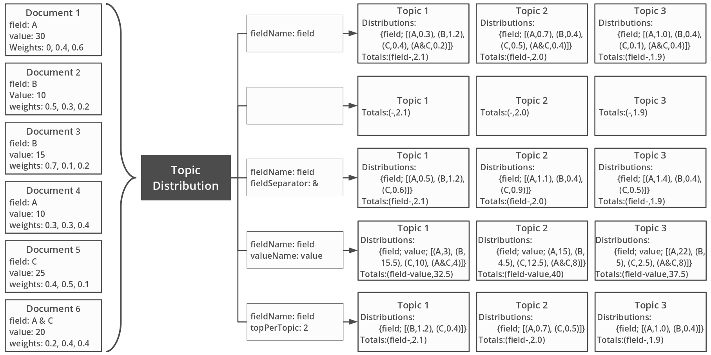

# Topic Mapping Pipeline - 2020 [![CC BY-NC 4.0][cc-by-nc-shield]][cc-by-nc]
# Topic Distribution Module

The Topic Distribution module is the sixth module of the Topic Mapping pipeline, and second in the `P4_Analysis` 
package. It reads the topic weights in documents to get customized topic distribution across document fields, e.g.
authors, organisations, years, etc. It then saves this information either in the ***Topic JSON files***, or in separate
***Distribution JSON file***.

The use of this module is optional.

The Topic Distribution module is contained in the `P4_Analysis.TopicDistribution` package, in the
`TopicDistribution.java` class.

## Specifications

The Topic Distribution module entry in the project file should have the following structure:
```json5
{...
  "distributeTopics": {
    "documents": "path",
    "mainTopics": "path",
    "subTopics": "path",
    "mainOutput": "path",
    "subOutput": "path",
    "distributions": [ ... ]
  },
...}
``` 

Where:
- `documents` is the path to the docuemnts JSON file (generated by one of the
[Topic Model module](ModelModule.md));
- `mainTopics` is the path to the topics JSON file (generated by the simple
[Topic Modelling module](ModelModule.md)), or to the main topics JSON file (generated by the
[Hierarchical Topic Modelling module](ModelModule.md));
- `subTopics` is the path to the sub topics JSON file (generated by the
[Hierarchical Topic Modelling module](ModelModule.md)), it is optional and won't distribute sub topics if not specified;
- `mainOutput` is the path to the topics JSON file generated from distributing the main topics;
- `subOutput` is the path to the topics JSON file generated from distributing the sub topics, it is only required if
`subTopics` has been specified;
- `distributions` list the specifications for each distribution to perform.

Note that sub-topics won't be distributed if the meta-parameter `modelType` is set to `simple`.

The Topic Distribution module allows for multiple distributions to be calculated simultaneously. Each distribution
is specified using an object in the `distributions` field shown above. A distribution specification has the following
structure:
```json5
{...
  "distributeTopics": {...
    "distributions": [{
      "fieldName": "key",
      "fieldSeparator": "-",
      "valueField": "key2",
      "topPerTopic": 3,
      "output": "path"
    }, ...]
  },
...}
```

Where:
- `fieldName` is the key to access the values in the `docData` of each document across which to distribute the topics,
it is optional, if not specified or left empty only the distribution totals are calculated;
- `fieldSeparator` is a string of character allowing to separate the values attached to `fieldName` before distributing
them, e.g. an author field containing `Name1 - Name2`, can be separated to have `Name1` and `Name2`;
- `valueField` is the key to access values in the `docData` of each document to use as weights for the distribution
value, these values have to be numerical, e.g. funding, it is optional, if not specified or left empty the topics are
distributed across the *count of documents* (i.e. using `1` for each document);
- `topPerTopic` is the maximum number of entries to save in the list of topic distribution (e.g. if there is a too
large number of unique values), it is optional and defaults to `-1` meaning no maximum;
- `output` is the path to the distribution JSON file to save the topic distributions, it is optional and if not
speficied or left empty the distributions are saved in the topic JSON file.

The image below illustrates the results of using these options.



## Output

The distributions generated by the Topic Distribution module can be saved in two ways:
- in a separate distribution JSON file;
- in the topic JSON file.

The distribution JSON file has the following structure:
```json5
{
  "distributionField": "fieldName",
  "distributionValue": "valueName",
  "mainTopics": [
    {
      "topicId": "0",
      "total": 45.0,
      "distribution": [ { "id": "fieldValue1", "weight": 10.0}, ... ]
    },
  ...],
  "subTopics":  [ ... ]
}
```

`distributionField` and `distributionValue` both record, if set in the specifications, the `fieldName` and `valueName`
of the distribution respectively.

The `mainTopics` list contains an entry for each of the topics in the `mainTopics` JSON file:
- `topicId` is the topic identifier;
- `total` is the distribution sum;
- `distribution` lists, for each unique value of `fieldName` (identified with `id`), the topic `weight` (limited to 
`topPerTopic` entries if not set to `-1`);

The `subTopics` list is only saved if sub topics were provided, its structure is similar to `mainTopics`.

If saved in the topic JSON files, each topic entry gets two additional lists: 
 ```json5
{...
"topics": [
    {
      "topicId": "0",
      "topicIndex": 0,
      "subTopicIds": [ ... ],
      "topDocs": [ ... ],
      "topWords": [ ... ],
      "totals": [
        {
          "weight": 247.0,
          "id": "fieldName-valueName"
        }, ...
      ],
      "distributions": [
        {
          "topWeights": [ {"weight": 59.0, "id": "fieldValue1" }, ... ],
          "field": "fieldName",
          "value": "valueName"
        }, ...
      ]
    }, ...
  ]
...}
```

`totals` lists the topic total (`weight`) of each distribution saved, this total is identified (`id`) by the
concatenation of the `fieldName` and `valueName` if these were specified.

`distributions` lists all the distributions for that topic, recording the `field` and `value` used, and listing, for
each unique value of `fieldName` (identified with `id`), the topic `weight` (limited to `topPerTopic` entries if not
set to `-1`).

---

[< Previous](LabelIndexModule.md) | [Index](index.md) | [Next >](TopicClusteringModule.md)

---
This work is licensed under a [Creative Commons Attribution 4.0 International
License][cc-by-nc].

[![CC BY-NC 4.0][cc-by-nc-image]][cc-by-nc]

[cc-by-nc]: http://creativecommons.org/licenses/by-nc/4.0/
[cc-by-nc-image]: https://i.creativecommons.org/l/by-nc/4.0/88x31.png
[cc-by-nc-shield]: https://img.shields.io/badge/License-CC%20BY--NC%204.0-lightgrey.svg
